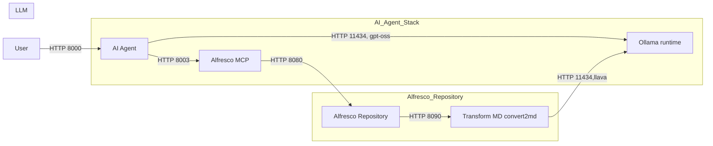

# Alfresco Agents Lab (CLive)

[](https://www.docker.com/)
[](https://www.python.org/)
[](https://fastapi.tiangolo.com/)
[](https://www.apache.org/licenses/LICENSE-2.0)
[](https://www.llamaindex.ai/)
[](https://github.com/Alfresco)

End-to-end lab to run Alfresco Community (with Markdown renditions) + an MCP server (with a Markdown tool) + a FastAPI Agent that consumes MCP tools through LlamaIndex. Everything can be started **from the repo root** with a single Compose file.

> The MCP tool added here follows the lab guide: "Add MCP Tool" in `lab-material/add-mcp-tool.md`

## Repository layout

```
/
├─ alfresco-deployment/          # Complete Alfresco CE deployment (repo, solr, share, ACA, transforms, proxy)
│  ├─ compose.yaml
├─ alfresco-mcp-server/          # Containerized MCP server wired to Alfresco
│  ├─ compose.yaml
│  ├─ Dockerfile
│  └─ get_markdown_content.py    # Tool implementation (see “Added MCP tool”)
├─ fastapi-agent/                # FastAPI service (Agent) with LlamaIndex + MCP tools
│  ├─ compose.yaml
│  ├─ main.py
│  └─ dockerfile
├─ lab-material/
│  ├─ add-mcp-tool.md            # Step-by-step guide for adding the Markdown tool
│  └─ add-action-to-aca.md       # Step-by-step guide for adding a Summarizing action to ACA UI
└─ compose.yaml                  # Root Compose that includes the two sub-stacks + agent
```

## Architecture



## Running

1. Prereqs

* Docker Desktop / Engine with Docker Compose v2 (supports `include:` in `compose.yaml`)
* Ollama running on your host with required models

  ```bash
  # for the Markdown transformer
  ollama pull llava
  # for the agent (or change OLLAMA_MODEL in .env)
  ollama pull gpt-oss
  ```

  Ollama should listen on `http://localhost:11434` (used via `host.docker.internal` inside containers)

2. Up the full stack from the repo root

```bash
docker compose up --build
```

3. Open the UIs

* Alfresco Content App: [http://localhost:8080/](http://localhost:8080/)
* Alfresco Repository: [http://localhost:8080/alfresco/](http://localhost:8080/alfresco/)
* MCP Server (health/endpoint): [http://localhost:8003/mcp](http://localhost:8003/mcp)
* Agent API (FastAPI): [http://localhost:8000/](http://localhost:8000/)  (health), `POST /agent` (run)

## Using the Agent

The Agent consumes **MCP tools** from `alfresco-mcp-server` and runs prompts with your chosen LLM

Run an agent turn, like in following samples

```bash
curl -sS http://localhost:8000/agent \
  -H "Content-Type: application/json" \
  -d '{"prompt":"What tools do you have?","instructions": "Be helpful and concise"}'
```

```bash
curl -sS http://localhost:8000/agent \
  -H "Content-Type: application/json" \
  -d '{"prompt":"Fetch Markdown for node 947c51e2-6ffd-4eb8-bc51-e26ffd1eb8b6 and summarize it"}'
```

## Lab Guides

The repository includes practical tutorials:

| Guide                                                  | Description                                                                          |
| ------------------------------------------------------ | ------------------------------------------------------------------------------------ |
| [Add MCP Tool](lab-material/add-mcp-tool.md)           | Explains how to develop and register a new MCP tool to access Alfresco content       |
| [Add Action to ACA](lab-material/add-action-to-aca.md) | Describes how to extend Alfresco Content App to trigger the AI summarization process |

Each guide is designed to be followed independently, but together they form a complete learning path from *zero to AI-enhanced Alfresco*

## Development Notes

You can rebuild or tweak individual components using their internal `compose.yaml` files

For example, to develop and test the MCP server alone:

```bash
cd alfresco-mcp-server
docker compose up --build
```

To run the FastAPI agent in local development mode:

```bash
cd fastapi-agent
uvicorn main:app --reload --port 8000
```

## Related Resources

* [Spring AI](https://docs.spring.io/spring-ai/reference/)
* [Model Context Protocol (MCP)](https://modelcontextprotocol.io)
* [LlamaIndex Documentation](https://docs.llamaindex.ai)
* [Ollama](https://ollama.ai)