# Add a “Summarize” Action to Alfresco Content App

This guide walks you step-by-step through creating a new **action in [Alfresco Content App (ACA)](https://github.com/Alfresco/alfresco-content-app)** that summarizes a document using the **FastAPI Agent** and stores the result in the document’s `cm:description` property.

## What We’re Building

You’ll extend ACA with a new action called **"Summarize"**:

* It appears in **Context Menu**, **Toolbar**, and **Viewer Toolbar**
* When clicked, it:

  * Sends a request to the **FastAPI Agent** (`/agent`) asking to summarize the selected document
  * Updates the document’s **`cm:description`** property with the generated summary
  * Displays a small notification (snackbar) before and after execution

In plain terms

> The user clicks **Summarize** > ACA calls the Agent > the Agent retrieves, summarizes and updates the document > ACA notifies the user once it’s done

## Requirements

### Runtime Environment

You need the **Alfresco Agents Lab** stack running locally, with the Agent REST API available at:

```
http://localhost:8000/agent
```

Follow the setup instructions in the root [README.md](../README.md).

### Development Environment

* Node.js 18 or later
* npm (bundled with Node)

Check your versions:

```bash
node --version
npm --version
```

If you need Node:

* macOS: `brew install node`
* Windows/Linux/macOS: [https://nodejs.org/en/download](https://nodejs.org/en/download)

## Set Up the Development Environment

Clone the official ACA repository

```bash
git clone git@github.com:Alfresco/alfresco-content-app.git
cd alfresco-content-app
```

Create a `.env` file to define your local repository endpoint

```bash
echo 'BASE_URL="http://localhost:8080"' > .env
```

Install dependencies

```bash
npm install
```

## Develop the Agent Integration

You’ll now create a small Angular extension that adds the "Summarize" action

1. Create the Extension Structure

```bash
mkdir -p projects/ext-summary/src
```

2. Create the Action Effect in file `projects/ext-summary/src/summary.effects.ts`:

```typescript
import { Injectable, inject } from '@angular/core';
import { Actions, createEffect, ofType } from '@ngrx/effects';
import { HttpClient } from '@angular/common/http';
import { MatSnackBar } from '@angular/material/snack-bar';
import { tap } from 'rxjs';

@Injectable()
export class SummaryEffects {
  private actions$ = inject(Actions);
  private http = inject(HttpClient);
  private snackBar = inject(MatSnackBar);

  summarize$ = createEffect(
    () =>
      this.actions$.pipe(
        ofType('SUMMARY'),
        tap((action: any) => {
          const node = action.payload;
          const nodeId = node.id;
          const nodeName = node.name;
          const prompt = `Fetch Markdown for node ${nodeId}, summarize it in 50 words or less and store the result in cm:description property.`;

          // Notify user that summarization has started
          this.snackBar.open(`Summary requested for ${nodeName}`, 'OK', { duration: 3000 });

          // Call FastAPI Agent
          this.http.post('/agent', { prompt }).subscribe({
            next: () => this.snackBar.open(`Summary completed for ${nodeName}`, 'OK', { duration: 3000 }),
            error: () => this.snackBar.open(`Summary failed for ${nodeName}`, 'Close', { duration: 3000 })
          });
        })
      ),
    { dispatch: false }
  );
}
```

> Effects in ACA listen to specific action types (`SUMMARY` here) and react to them. In this case, by triggering an HTTP POST to the Agent

3. Define the Extension Manifest

Create `projects/ext-summary/src/assets/ext-summary.plugin.json`:

```json
{
  "$schema": "../../../../extension.schema.json",
  "$id": "aca-ext-summary",
  "$version": "1.0.0",
  "$name": "Summarize",
  "$vendor": "Alfresco",
  "$license": "LGPL-3.0",

  "actions": [
    { "id": "summary", "type": "SUMMARY", "payload": "$(context.selection.first.entry)" }
  ],

  "features": {
    "toolbar": [
      {
        "id": "app.toolbar.more",
        "children": [
          {
            "id": "summary.toolbar.button",
            "order": 90,
            "icon": "description",
            "title": "Summarize",
            "actions": { "click": "summary" },
            "rules": { "visible": ["app.selection.file"] }
          }
        ]
      }
    ],
    "contextMenu": [
      {
        "id": "summary.context.button",
        "order": 450,
        "icon": "description",
        "title": "Summarize",
        "actions": { "click": "summary" },
        "rules": { "visible": ["app.context.file"] }
      }
    ],
    "viewer": {
      "toolbarActions": [
        {
          "id": "app.viewer.toolbar.more",
          "children": [
            {
              "id": "summary.viewer.button",
              "order": 1,
              "icon": "description",
              "title": "Summarize",
              "actions": { "click": "summary" }
            }
          ]
        }
      ]
    }
  }
}
```

> This JSON describes where the action appears (toolbar, context menu, viewer) and how it behaves when clicked

4. Register the Module

Create `projects/ext-summary/src/ext-summary.module.ts`:

```typescript
import { NgModule, Provider, EnvironmentProviders } from '@angular/core';
import { provideExtensionConfig } from '@alfresco/adf-extensions';
import { provideEffects } from '@ngrx/effects';
import { SummaryEffects } from './summary.effects';

export function provideSummaryExtension(): (Provider | EnvironmentProviders)[] {
  return [
    provideExtensionConfig(['ext-summary.plugin.json']),
    provideEffects(SummaryEffects)
  ];
}

@NgModule({
  providers: [...provideSummaryExtension()]
})
export class ExtSummaryModule {}
```

And export the module in `projects/ext-summary/src/public-api.ts`:

```typescript
export * from './ext-summary.module';
```

Here is the final result:

```bash
$ tree ext-summary
ext-summary
└── src
    ├── assets
    │   └── ext-summary.plugin.json
    ├── ext-summary.module.ts
    ├── public-api.ts
    └── summary.effects.ts
```

## Attach the Extension to ACA

Edit `app/src/app/extensions.module.ts` and import the new extension

```typescript
import { provideSummaryExtension } from 'projects/ext-summary/src/public-api';

export function provideApplicationExtensions(): (Provider | EnvironmentProviders)[] {
  return [
    ...provideSummaryExtension(),
    // keep other extensions here
  ];
}
```

### Add Extension Assets to Build

Edit `app/project.json` and include your JSON plugin file under the build assets section

```json
{
  "targets": {
    "build": {
      "options": {
        "assets": [
          { "glob": "ext-summary.plugin.json", "input": "projects/ext-summary/src/assets", "output": "./assets/plugins" }
        ]
      }
    }
  }
}
```

### Configure Proxy to Bypass CORS

Edit `app/proxy.conf.js` and **add** the Agent endpoint

```javascript
module.exports = {
  '/agent': {
    target: 'http://localhost:8000',
    changeOrigin: true,
    secure: false,
    logLevel: 'debug'
  }
};
```

> This ensures that the browser can call the Agent REST API via the ACA dev server without CORS issues

## Testing the Action

Start ACA locally

```bash
npm start
```

Access [http://localhost:4200](http://localhost:4200) and log in (default `admin` / `admin`)

1. Select any document.
2. Click the **Summarize** action (context menu, toolbar, or viewer)
3. You’ll see:

   * A toast: *"Summary requested for document.pdf"*
   * After processing: *"Summary completed for document.pdf"*


Now open the **Properties** panel: the `Description` field (`cm:description`) should contain the generated summary

## What Just Happened?

With only a few lines of code, you’ve chained together a full cross-system workflow

1. **ACA (Angular)** sends a simple request to the Agent

   ```
   Fetch Markdown for node ${nodeId}, summarize it in 50 words or less and store the result in cm:description property.
   ```
2. **FastAPI Agent** interprets that prompt, communicates with the **Alfresco MCP**, fetches the document’s Markdown rendition, and generates the summary
3. **MCP → Repository** updates the `cm:description` field
4. **ACA** simply waits and displays notifications, no complex backend code needed

> This is the power of prompt-driven integration: a single human-readable instruction can orchestrate multiple system actions

### Visual Overview

```mermaid
sequenceDiagram
    autonumber
    participant U as 🧑‍💻 User (ACA UI)
    participant A as 🖥️ Alfresco Content App (Angular)
    participant F as ⚡ FastAPI Agent (localhost:8000)
    participant M as 🤖 Alfresco MCP
    participant R as 🗃️ Alfresco Repository

    Note over U,A: 1️⃣ User clicks **"Summarize"** action
    U->>A: Clicks “Summarize” (context / toolbar / viewer)

    Note over A: 2️⃣ ACA triggers SUMMARY effect
    A->>F: POST /agent<br/>{"prompt": "Fetch Markdown for node {id}, summarize it..."}

    Note over F: 3️⃣ Agent interprets the prompt
    F->>M: Request Markdown rendition<br/>(via MCP Tool)
    M->>R: Fetch node content<br/>(/nodes/{id}/renditions/md)
    R-->>M: Return Markdown text
    M-->>F: Markdown retrieved

    Note over F: 4️⃣ LLM Summarization
    F->>F: Generate summary (Ollama / LLM)
    F->>M: Update cm:description<br/>with generated summary
    M->>R: PATCH /nodes/{id}/metadata
    R-->>M: Metadata updated
    M-->>F: Operation success

    Note over F,A: 5️⃣ Notify ACA
    F-->>A: 200 OK
    A-->>U: Toast: “Summary completed for document.pdf”

    Note over R: ✅ `cm:description` now contains the summary
```



## Next Steps

* Extend the prompt with metadata awareness (e.g., “use title and author to improve summary quality”)
* Add visual feedback (spinners or progress banners)
* Chain multiple actions (e.g., “Translate and summarize”)
* Contribute your extension to the [Alfresco Agents Lab](https://github.com/aborroy/alfresco-agents-lab-clive) project!
